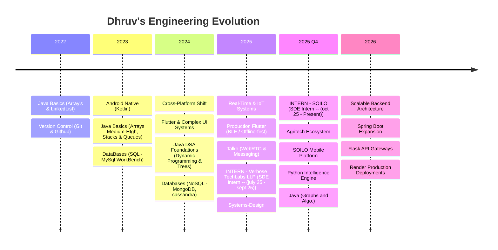
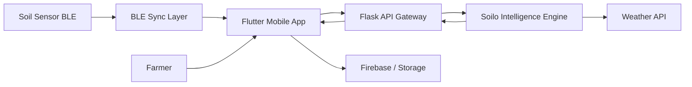
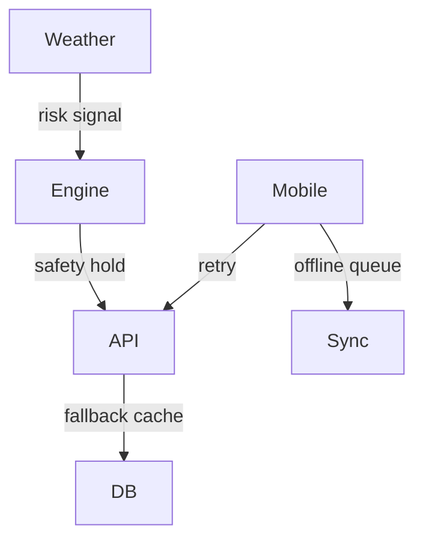

Software Engineer — Mobile Systems • Real-Time Communication • Applied AI  
Building production systems that operate under real constraints — connectivity, latency, and scale.

---

## What I Build

I design end-to-end systems — mobile clients, backend intelligence engines, and real-time communication layers.

My recent work focuses on:

• Agricultural AI platforms used by real farmers  
• BLE + IoT mobile architectures  
• Real-time messaging & WebRTC systems  
• Deterministic intelligence engines (Python)  
• Performance-first Flutter applications  
• Expanding into backend systems with Spring Boot  

---

##  Tech Evolution

---

## Explore My Work

--> Interested in applied AI systems → expand **Soilo Intelligence Engine**  
--> Interested in mobile architecture → expand **Soilo Platform**  
--> Interested in real-time systems → expand **Talko**  
--> Interested in algorithmic depth → expand **DSA Repository**

---

 SOILO Platform — Mobile + IoT System

### Problem
Farmers lack stage-specific agronomic guidance and real-time soil visibility.

### Solution
A Flutter application connecting BLE soil sensors with an intelligence backend.

### System Data Flow

### Engineering Focus
• Offline-first design  
• Sensor reliability handling  
• Multilingual UX  
• Historical analytics  
• AI advisory chat  

### Impact
Production deployment serving real agricultural workflows.

---

 Soilo Intelligence Engine — Applied AI Backend

Python Flask engine acting as a digital agronomist.

### Capabilities
• Growth-stage aware fertilizer calculation  
• Regional modifiers across Indian states  
• Toxicity prevention logic  
• Weather risk holds  
• Product recommendation mapping  

### Reliability Flow

### Design Approach
Deterministic rules over black-box ML for reliability and explainability.

### Why it matters
Farm recommendations must be safe, explainable, and context-aware.

---

 Talko — Real-Time Communication Systems

Messaging and WebRTC video infrastructure.

### Engineering Focus
• Message ordering guarantees  
• Delivery state analytics  
• Retry & failure handling  
• State machines for chat lifecycle  
• Latency optimization  

Real-time systems are about correctness under unreliable networks.

---

 DSA Repository — Algorithmic Foundations

Large-scale Java repository focused on building strong algorithmic intuition and problem-solving discipline.

### Scope
• Arrays, Linked Lists, Trees, Graphs  
• Dynamic Programming  
• Recursion & Backtracking  
• Greedy & Sliding Window  
• Advanced problem patterns  

### Highlights
• 250+ LeetCode problems solved across difficulty levels  
• Emphasis on pattern recognition over memorization  
• Clean implementations with readability focus  
• Continuous practice to strengthen interview performance  

### Why it matters
Strong systems engineers rely on algorithmic clarity for designing efficient solutions and reasoning about tradeoffs.

---

## Engineering Principles

• Reliability over novelty  
• Deterministic systems where correctness matters  
• Mobile clients must tolerate failure  
• Observability is a feature  
• Performance is UX  
• Clean architecture enables iteration  

---

## Selected Public Work

• Talko — Real-time messaging & video  
• Soil — IoT soil monitoring  
• DSA — Algorithm practice repository  

(Private production systems described above)

---

## GitHub Activity

 

---

## Contact

LinkedIn — https://www.linkedin.com/in/dhruv-chaurasia-0b1093253/  
GitHub — https://github.com/DhruvChaurasia9403  
LeetCode — https://leetcode.com/u/DhruvChaurasia9403/

---

“Build systems that continue working when assumptions fail.”

